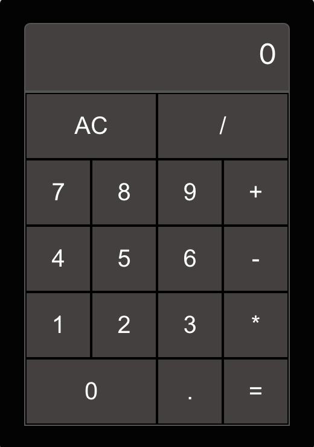

# Calculator App

A simple calculator web application built using React.js.



## Table of Contents

- [Introduction](#introduction)
- [Features](#features)
- [Demo](#demo)
- [Getting Started](#getting-started)
  - [Prerequisites](#prerequisites)
  - [Installation](#installation)
- [Usage](#usage)


## Introduction

This calculator application is a basic web-based calculator built using React.js. It provides a user-friendly interface for performing basic arithmetic operations such as addition, subtraction, multiplication, and division. 

## Features

- Addition, subtraction, multiplication, and division operations.
- User-friendly interface with buttons for numbers and operators.
- Real-time display of input and results.

## Demo
You can try the live demo of this project at [https://calculator-app-b477d4f07843.herokuapp.com/].

## Installation

### Prerequisites
- [Node.js](https://nodejs.org/) installed on your computer
- npm (Node Package Manager) comes bundled with Node.js

### Installation
1. Clone the repository:
   ```sh
   git clone https://github.com/EddieChen8/calcultor-app.git
   cd calcultor-app

2. Install project dependencies:
   ```sh
   npm install

3. Start the development server:
   ```sh
   npm start

4. Open your web browser and visit http://localhost:3000 to access the application.


## Usage
- To perform arithmetic operations, click the number buttons and operator buttons.
- The current input and result are displayed in real-time.
- Click the "=" button to calculate the result.
- To clear the input and start over, click the "AC" button.
